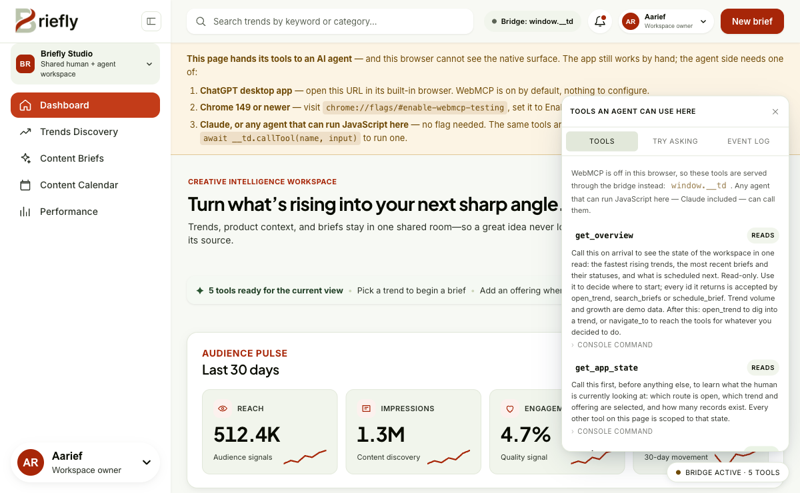
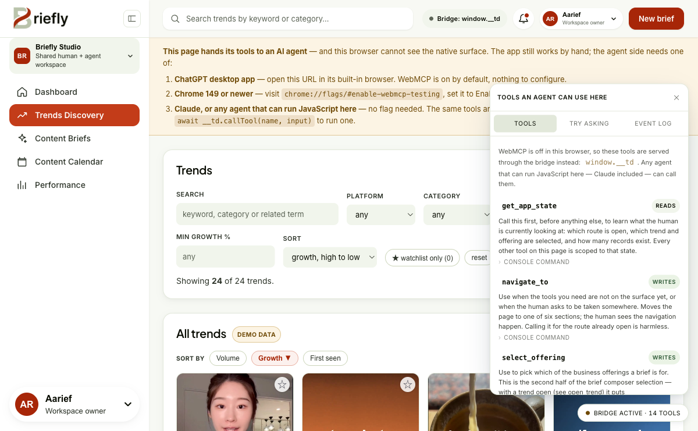
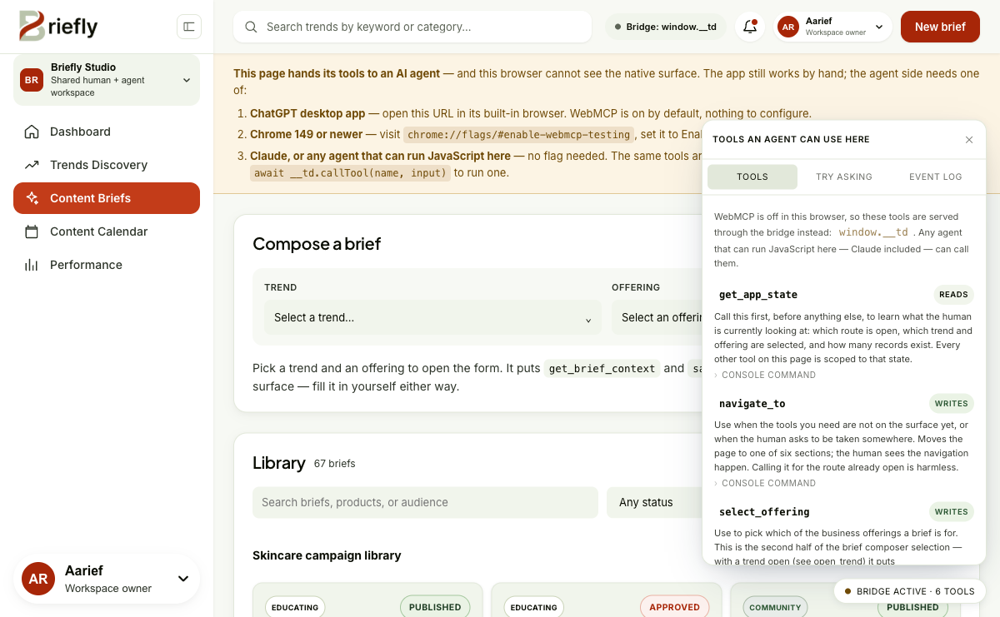
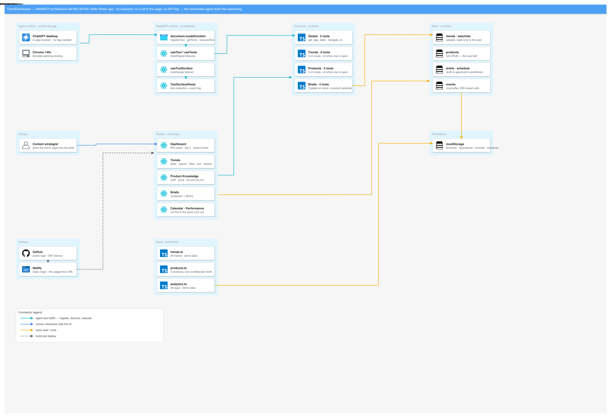

<p align="center">
  
</p>

<h1 align="center">Briefly</h1>

<p align="center">
  <strong>Turn trend research and business context into grounded content briefs —
  with an AI agent working the same screen the human is.</strong>
</p>

<p align="center">
  <a href="LICENSE"></a>
  
  
  
  
  
  
</p>

<p align="center">
  <a href="https://briefly-1.vercel.app/"><strong>Live app</strong></a> ·
  <a href="#quick-start">Quick start</a> ·
  <a href="#why-webmcp">Why WebMCP</a> ·
  <a href="#using-it-with-an-agent">Use it with an agent</a> ·
  <a href="#architecture">Architecture</a>
</p>

---

| | |
|---|---|
| **Live app** | <https://briefly-1.vercel.app/> |
| **Source** | <https://github.com/codeby-dani/briefly> |
| **Demo video** | _add the public YouTube link here (under 3 minutes)_ |
| **Devpost entry** | _add the Devpost project URL here_ |
| **Built for** | [The WebMCP Challenge](https://webmcp.devpost.com) |
| **Licence** | [MIT](LICENSE) |

## Contents

- [Overview](#overview)
- [Why WebMCP](#why-webmcp)
- [Screens](#screens)
- [Quick start](#quick-start)
- [Using it with an agent](#using-it-with-an-agent)
- [Configuration](#configuration)
- [Architecture](#architecture)
- [Data provenance](#data-provenance)
- [Design system](#design-system)
- [Media and attribution](#media-and-attribution)
- [Project status](#project-status)
- [Licence](#licence)

## Overview

Briefly is a content-marketing workspace where trend research, a business
profile, and brief writing happen in one place — and where a connected AI agent
works the same surface the human does, over
[WebMCP](https://github.com/webmachinelearning/webmcp).

The page does not do the reasoning. It exposes what the human is looking at as
tools; the agent reads that context and writes results back into the app, so the
brief lands in the library rather than in a chat transcript.

**In one workspace**

| Route | Surface | What it holds |
|---|---|---|
| `#/dashboard` | **Dashboard** | Workspace overview — rising trends, recent briefs, what is scheduled next |
| `#/trends` | **Trends Discovery** | 24 seeded trends with filters, sort, watchlist and per-trend detail |
| `#/products` | **Profile** | The business profile — offerings, audience, and do-not-say guidance |
| `#/briefs` | **Content Briefs** | A composer scoped to a trend + offering, and the brief library |
| `#/calendar` | **Content Calendar** | Scheduling, status chips, and CSV export |
| `#/performance` | **Performance** | Analytics context for what already shipped |

Alongside all six, a tool surface panel renders whatever the agent can currently
call, with a paste-ready `callTool` line per tool.

## Why WebMCP

**The problem.** A content team's context is spread across a trend dashboard,
product notes, an AI chat, and a brief document. To get one brief written, a
person copies the trend into a prompt, restates the brand's offerings and
do-not-say rules from memory, then pastes the answer back somewhere useful. The
grounding is retyped every time, and the output lands in a transcript instead of
in the product.

**Why this is a WebMCP use case and not an API.** The context that matters here
is *view state*: the trend open right now, the offering just selected, the
brief's current workflow status. A backend API cannot see any of it. WebMCP can,
because the page itself publishes the tools — so the agent reads what the human
is looking at instead of asking them to describe it.

**What people and agents can now do together.** The agent inspects the open
trend, reads the business profile and its do-not-say guidance, and writes a
brief straight into the library, where the human edits and publishes it. The
person keeps selection and publication: `save_brief` creates a draft and cannot
publish one. The result is reviewable and durable because it lives in the
product's own workflow.

**How the surface is implemented.** Registration is tied to route and selection
state through `AbortSignal` lifecycles, so the surface is never a flat list of
everything — it grows and shrinks with the view:

| View | Tools on the surface |
|---|---|
| Dashboard | 5 |
| Trends Discovery | 14 |
| Content Briefs | 6 |
| **Defined in total** | **37** |

Brief-composer tools appear only once both a trend and an offering are selected,
and disappear when that context closes. Tools return structured data rather than
prose, every call carries a trace ID into a bounded local event log, and
user-authored fields are marked as untrusted content for agents.

## Screens

<table>
  <tr>
    <td width="50%"></td>
    <td width="50%"></td>
  </tr>
  <tr>
    <td><strong>Dashboard</strong> — the workspace overview, with the live tool surface panel on the right. 5 tools.</td>
    <td><strong>Trends Discovery</strong> — 24 seeded trends, filters, sort and watchlist. 14 tools.</td>
  </tr>
  <tr>
    <td colspan="2"></td>
  </tr>
  <tr>
    <td colspan="2"><strong>Content Briefs</strong> — the composer is scoped to a trend and an offering; the library holds what has been written. 6 tools.</td>
  </tr>
</table>

## Quick start

Requires Node 20+ and npm.

```bash
git clone https://github.com/codeby-dani/briefly.git
cd briefly
npm ci
npm run dev
```

The app runs at `http://localhost:5173` with no API key and no account. Seeded
data ships in the repo, so every screen is populated on first load.

| Script | What it does |
|---|---|
| `npm run dev` | Vite dev server |
| `npm run build` | Type-check and production build — must exit 0 |
| `npm run preview` | Serve the production build locally |
| `npm run lint` | oxlint |
| `npm run verify:tools` | Drive every tool's input validation |
| `npm run verify:dashboard` | Render-level checks on the dashboard |
| `npm run verify:brand` | Check brand assets resolve |

## Using it with an agent

`document.modelContext` is a Chrome 149+ feature and ships enabled in exactly
one place today, so the tools are reachable three ways rather than one:

| Environment | How | Needs a flag |
|---|---|---|
| **ChatGPT desktop app** | Open the URL in its built-in browser and ask what it can do here. | no |
| **Chrome 149+** | `chrome://flags/#enable-webmcp-testing` → Enabled → restart. | yes |
| **Claude, or any agent that can run JavaScript on the page** | Use the `window.__td` bridge below. | no |

### The bridge

Claude has no WebMCP-native browser today, so every tool registers twice: with
`document.modelContext` where that exists, and always with a small local
registry at `window.__td`.

```js
window.__td.describe()                      // what this surface is
window.__td.listTools()                     // name, description, schema, annotations
await window.__td.callTool('get_app_state', {})
window.__td.onChange(fn)                    // fires when the surface changes
```

Same names, same schemas, and the *same executor functions* as the WebMCP path —
one definition, two doors, so the two cannot drift apart. This is not a WebMCP
implementation and does not pretend to be one: a browser with the real API uses
the real API, and the bridge is what everyone else gets.

It also makes the app inspectable with no agent at all. The panel in the corner
renders whichever surface is live, and every tool row carries a paste-ready
`callTool` line with a copy button — required arguments filled in from the
tool's own schema, so driving the app from the DevTools console needs no
hand-assembly from JSON Schema.

## Configuration

Everything runs without configuration. Two serverless endpoints call Gemini's
free tier and degrade cleanly when no key is present.

```bash
cp .env.example .env.local   # then add GEMINI_API_KEY
```

| Variable | Required | Default | Used by |
|---|---|---|---|
| `GEMINI_API_KEY` | no | — | `/api/analyze`, `/api/brief` |
| `GEMINI_MODEL` | no | `gemini-3.1-flash-lite` | both endpoints |

On Vercel the key belongs in the project's environment variables and **never**
in a committed file.

| Endpoint | Backs | Behaviour with no key |
|---|---|---|
| `/api/analyze` | `analyze_trend` | Structured `503 llm_unavailable`; the tool falls back to a committed summary labelled `cached`. |
| `/api/brief` | `generate_brief` | Structured `503 llm_unavailable`; the tool tells the agent to write the fields itself. |

Neither endpoint can publish. `/api/brief` drafts and hands the draft back
labelled with the model that wrote it; the draft still has to pass through
`save_brief` to reach the library, and `save_brief` creates drafts only. No
button in the composer calls either endpoint — the page stays hand-usable.

## Architecture

| Path | What |
|---|---|
| `src/webmcp/` | Registration, lifecycle, the bridge, the live surface panel |
| `src/tools/` | Tool definitions — schemas, executors, trace wrapper |
| `src/store/` | Hash router, selection state, one store per domain |
| `src/routes/` | One file per route |
| `src/components/` | Badges and the hand-rolled SVG charts |
| `src/fixtures/` | Seeded data and the generated clip corpus |
| `api/` | `/api/analyze` and `/api/brief` — all server-side code |
| `scripts/` | Clip measurement and the verification scripts |
| `docs/diagrams/` | Architecture and brief-flow diagrams |
| `plan/` | Sprint plan and phase notes, kept as a build record |

State lives in React-compatible stores persisted to `localStorage`. There is no
database and no account system.

<p align="center">
  
</p>

See also [`docs/diagrams/brief-flow.png`](docs/diagrams/brief-flow.png) for the
trend → offering → draft → library path.

## Data provenance

Numbers on screen are labelled by where they came from, and the two claims are
never blurred:

| Badge | Meaning | Covers |
|---|---|---|
| **`demo data`** | Invented for the demo. Nobody observed these. | Trend volumes, growth rates, engagement, all analytics |
| **`measured`** | Derived from a file in this repo by a committed script (`scripts/generate-clips.mjs`). | Clip duration, word count, speaking rate, hook length |

## Design system

The palette, type and radii come from the [Stitch](https://stitch.withgoogle.com)
reference set checked into
[`FE-design-stitch-reference/`](FE-design-stitch-reference/). What ships is the
**token set, not the markup**: Stitch emits Tailwind, and this project has no CSS
framework or UI library at all — React and React DOM are the only runtime
dependencies — so the resolved values were transcribed into the custom
properties at the top of [`src/index.css`](src/index.css). Nothing in `App.css`
names a colour directly, and the inspector panel reads the same tokens through
its own `--panel-*` properties rather than looking bolted on.

Two deliberate departures from the reference:

- **Web fonts load, but never block paint.** `index.html` requests Inter and
  Plus Jakarta Sans with `display=swap` behind a full platform fallback stack,
  so a slow or blocked font CDN costs a swap, never a blank page.
- **No icon font.** The reference draws icons from the Material Symbols variable
  font, whose failure mode is the worst available — every glyph renders as the
  literal word `trending_up`. Nav icons here are inline SVG.

## Media and attribution

The 12 clips in `public/media/` come from
[ClipBrief](https://github.com/aliefauzan/ClipBrief), a public repo by the same
author. Every clip is `cc0` and self-generated — script written by the author,
voiced with macOS text-to-speech, over generated footage. No third-party media
is used anywhere in this project.

## Project status

Every product feature is built and live. Trends, Product Knowledge, the brief
composer and library, Calendar and Performance are all on the live URL, and all
37 tools register against it. The bundle the live origin serves is the bundle
`npm run build` produces from this commit, so nothing on screen is behind the
source. The deployment sends `Permissions-Policy: tools=(self)`.

Briefly was created during the WebMCP Challenge submission window; its git
history begins on 2026-09-03 with commit `ebe1b8a`, and every line under `src/`
is new work from that window. The only reused material is the author's own cc0
clip corpus described above — not application code, and not a pre-existing
product.

## Licence

[MIT](LICENSE).
