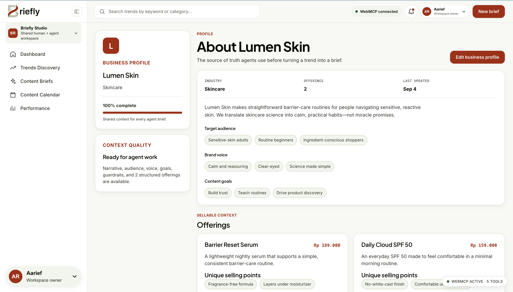
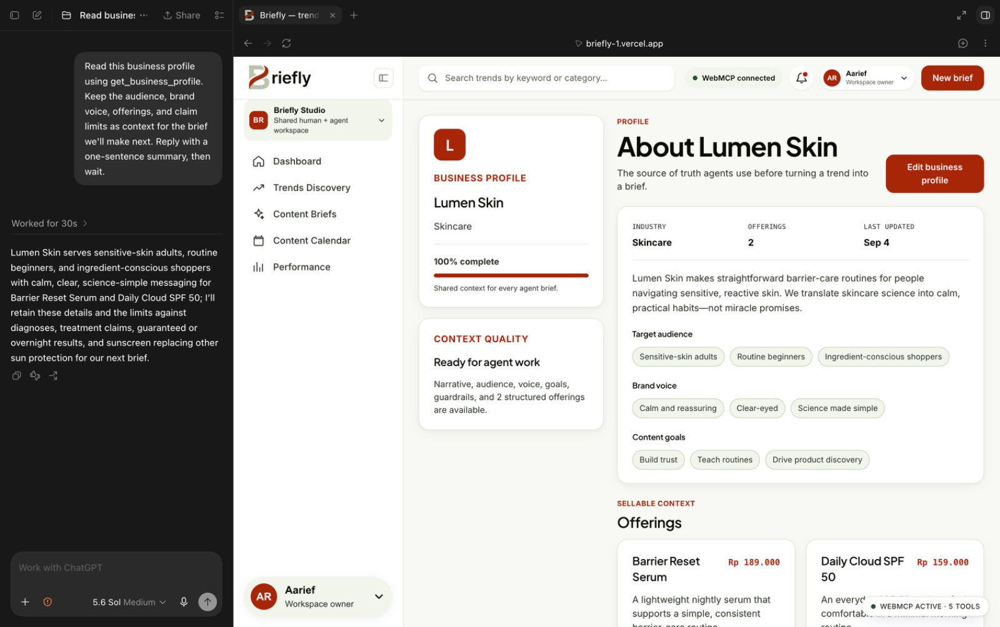
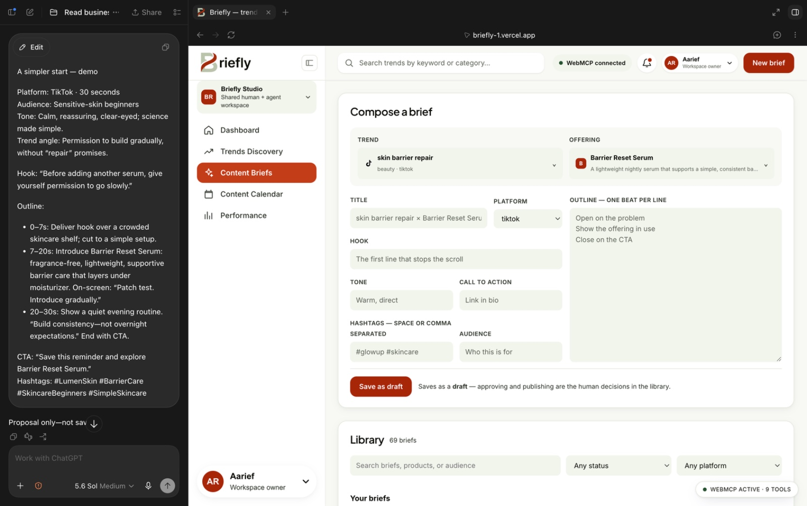
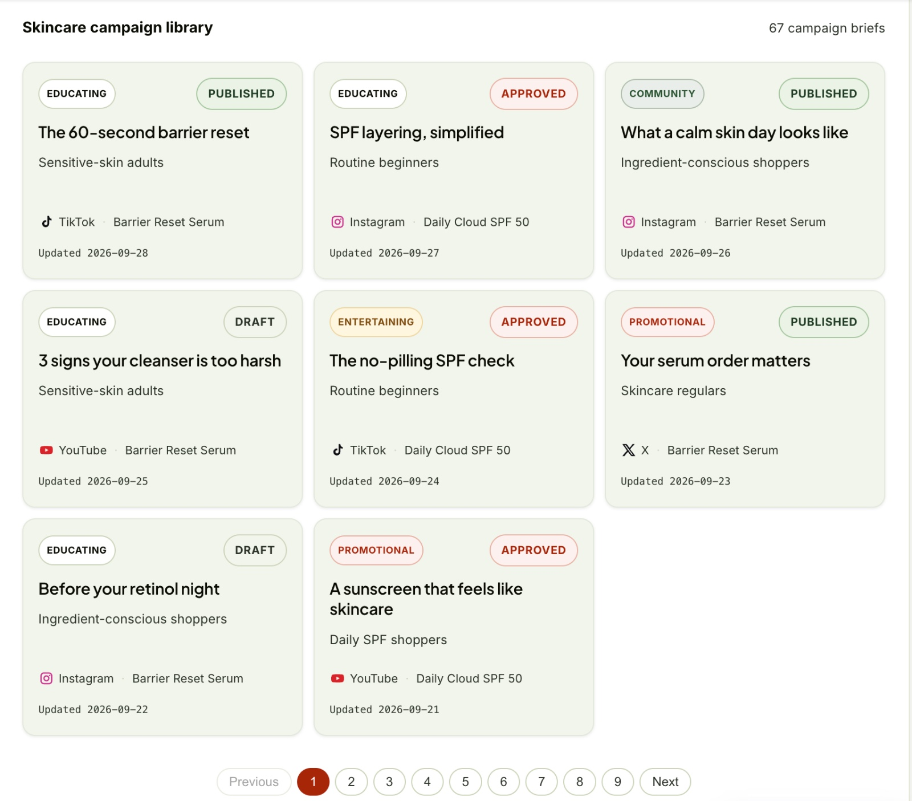

<p align="center">
  
</p>

<h1 align="center">Briefly</h1>

<p align="center">
  <strong>From rising trends to on-brand content briefs.<br />
  One shared workspace. 37 context-aware WebMCP tools.</strong>
</p>

<p align="center">
  <a href="LICENSE"></a>
  
  
  
  <a href="#all-37-webmcp-tools"></a>
  
  
  
</p>

<p align="center">
  <a href="https://briefly-1.vercel.app/"><strong>Live app</strong></a> ·
  <a href="https://youtu.be/fb9YCsPUoVA"><strong>Watch the demo</strong></a> ·
  <a href="#quick-start">Quick start</a> ·
  <a href="#why-webmcp">Why WebMCP</a> ·
  <a href="#using-it-with-an-agent">Use it with an agent</a> ·
  <a href="#all-37-webmcp-tools">37-tool reference</a> ·
  <a href="#architecture">Architecture</a>
</p>

---

| | |
|---|---|
| **Live app** | <https://briefly-1.vercel.app/> |
| **Source** | <https://github.com/codeby-dani/briefly> |
| **Demo video** | [Watch Briefly in action on YouTube](https://youtu.be/fb9YCsPUoVA) |
| **Built for** | [The WebMCP Challenge](https://webmcp.devpost.com) |
| **Licence** | [MIT](LICENSE) |

## Contents

- [Overview](#overview)
- [Why WebMCP](#why-webmcp)
- [Try the core workflow](#try-the-core-workflow)
- [All 37 WebMCP tools](#all-37-webmcp-tools)
- [Screens](#screens)
- [Quick start](#quick-start)
- [Using it with an agent](#using-it-with-an-agent)
- [Configuration](#configuration)
- [Architecture](#architecture)
- [Data provenance](#data-provenance)
- [Design system](#design-system)
- [Media and attribution](#media-and-attribution)
- [Project status](#project-status)
- [Verification](#verification)
- [Licence](#licence)

## Overview

Briefly is a content-marketing workspace where trend research, a business
profile, and brief writing happen in one place — and where a connected AI agent
works the same surface the human does, over
[WebMCP](https://github.com/webmachinelearning/webmcp).

Briefly gives an agent structured access to the same context and controls a
person uses. Read the business profile, explore a trend, propose a brief, and
save the result into the library. The agent can do the reasoning itself; optional
server-side model calls support analysis and drafting.

**The key idea: the tool surface follows the work.** Open a trend to expose its
detail tools. Open the profile editor to expose editing tools. Select a trend
and an offering to expose the three brief-composer tools. Close that context,
and those tools leave the surface.

**In one workspace**

| Route | Surface | What it holds |
|---|---|---|
| `#/dashboard` | **Dashboard** | Workspace overview — rising trends, recent briefs, what is scheduled next |
| `#/trends` | **Trends Discovery** | 24 seeded trends with filters, sort, watchlist and per-trend detail |
| `#/products` | **Profile** | The business profile — offerings, audience, and do-not-say guidance |
| `#/briefs` | **Content Briefs** | A composer scoped to a trend + offering, and the brief library |
| `#/calendar` | **Content Calendar** | Scheduling, status chips, and CSV export |
| `#/performance` | **Performance** | Seeded analytics and CSV export for exploring content performance |

Alongside all six, a tool surface panel renders whatever the agent can currently
call, with a paste-ready `callTool` line per tool.

## Why WebMCP

**The problem.** A content team's context is spread across a trend dashboard,
product notes, an AI chat, and a brief document. To get one brief written, a
person copies the trend into a prompt, restates the brand's offerings and
do-not-say rules from memory, then pastes the answer back somewhere useful. The
grounding is retyped every time, and the output lands in a transcript instead of
in the product.

**Why expose tools from the page?** The useful context is *view state*: the trend
open right now, the offering just selected, the editor the human opened.
Briefly registers tools against that state, so the agent can work with structured
inputs and results instead of reconstructing context from screenshots or asking
the person to copy it into a prompt.

**What people and agents can now do together.** The agent inspects the open
trend, reads the business profile and its do-not-say guidance, and writes a
brief into the library for review. `save_brief` always creates a draft. Approval
and publication status are separate actions; neither saving nor generating a
brief posts anything to a social platform.

**How the surface is implemented.** Registration is tied to route and selection
state through `AbortSignal` lifecycles, so the surface is never a flat list of
everything — it grows and shrinks with the view:

| View or state | Registered tools, including the 4 global tools |
|---|---|
| Dashboard | 5 |
| Trends Discovery, detail closed | 14 |
| Trends Discovery, detail open | 20 |
| Profile, editor closed / open | 5 / 9 |
| Content Briefs | 6 |
| Content Calendar | 9 |
| Performance | 6 |
| Trend **and** offering selected | Add 3 to any count above |
| **Unique tool definitions across the application** | **37** |

Brief-composer tools appear only once both a trend and an offering are selected,
and disappear when that context closes. Tools return structured data rather than
prose, every call carries a trace ID into a bounded local event log, and
tools that return user-authored context carry untrusted-content annotations.

## Try the core workflow

1. **Ground the work.** Open **Profile** and review Lumen Skin's audience, voice,
   offerings, and claim limits. Ask the agent to read `get_business_profile`.
2. **Choose a signal.** Open **Trends Discovery** and search for `skin barrier
   repair`. Open the trend to inspect its details and sample clips.
3. **Connect it to the business.** Select **Barrier Reset Serum**. With both
   selections present, `get_brief_context`, `generate_brief`, and `save_brief`
   become available.
4. **Draft, then review.** Ask for a brief grounded in that context. The agent
   can propose the fields itself or request the optional model-backed draft.
   Review the proposal before asking it to save.
5. **Keep the result.** `save_brief` creates a draft in **Content Briefs**.
   Review its status separately, then use **Content Calendar** to plan a slot.

Watch the tool panel during these steps: the available tools change with the
page state. A proposal in chat is not a saved brief; confirm the saved record in
the library. Local records persist in the same browser's `localStorage`.

## All 37 WebMCP tools

The table lists **unique tool names**, not simultaneous registrations. **Scope**
means when the app registers the tool. The three selection-scoped tools live at
the app root and remain available across routes while both selections exist.
`search_briefs` is shared by two routes but counted once.

| # | Tool | Scope | What it does |
|---|---|---|---|
| 1 | `get_app_state` | Global · every route | Reads the current route, selections, record counts, and active trend filters. |
| 2 | `navigate_to` | Global · every route | Opens one of the six workspace sections. |
| 3 | `select_offering` | Global · every route | Selects a business offering by ID, or clears the selection with `null`. |
| 4 | `get_tool_trace` | Global · every route | Reads the bounded local call log; filters by tool, trace ID, or failures. |
| 5 | `get_overview` | Dashboard | Summarizes rising trends, recent briefs, brief statuses, and upcoming schedule entries. |
| 6 | `search_trends` | Trends Discovery | Changes the visible trend search query. |
| 7 | `filter_trends` | Trends Discovery | Filters trends by platform, category, first-seen dates, and minimum growth. |
| 8 | `sort_trends` | Trends Discovery | Changes the trend list's sort field and direction. |
| 9 | `list_visible_trends` | Trends Discovery | Reads the trends matching the current search, filters, and sort. |
| 10 | `open_trend` | Trends Discovery | Selects a trend and opens its detail view. |
| 11 | `save_to_watchlist` | Trends Discovery | Adds a trend to the watchlist. |
| 12 | `remove_from_watchlist` | Trends Discovery | Removes a trend from the watchlist without deleting the trend. |
| 13 | `list_watchlist` | Trends Discovery | Reads saved watchlist trends. |
| 14 | `set_watchlist_only` | Trends Discovery | Toggles whether the visible list is restricted to saved trends. |
| 15 | `reset_trend_view` | Trends Discovery | Resets the trend view's search, filters, sort, and watchlist-only setting. |
| 16 | `get_trend_detail` | Trends Discovery · detail open | Reads the open trend's metrics, clips, summary, and related context. |
| 17 | `write_trend_summary` | Trends Discovery · detail open | Saves an agent-written explanation and suggested content angles for the open trend. |
| 18 | `clear_trend_summary` | Trends Discovery · detail open | Clears the open trend's saved analysis. |
| 19 | `play_clip` | Trends Discovery · detail open | Plays a clip attached to the open trend, optionally seeking to a start time. |
| 20 | `stop_clip` | Trends Discovery · detail open | Stops and unloads the current clip player. |
| 21 | `analyze_trend` | Trends Discovery · detail open | Requests server-side trend analysis; can fall back to a labelled cached summary. |
| 22 | `get_business_profile` | Profile | Reads the business narrative, audience, voice, goals, claim limits, and offerings. |
| 23 | `update_business_profile` | Profile · editor open | Patches shared business fields; refuses execution when the editor is closed. |
| 24 | `add_business_offering` | Profile · editor open | Adds a structured offering with positioning, price, selling points, and claim limits. |
| 25 | `update_business_offering` | Profile · editor open | Patches an existing offering by its exact ID. |
| 26 | `remove_business_offering` | Profile · editor open | Removes an offering by its exact ID. |
| 27 | `get_brief_context` | Any route · trend + offering selected | Reads the selected trend, offering, business context, and related briefs for drafting. |
| 28 | `generate_brief` | Any route · trend + offering selected | Requests a model-backed draft from `/api/brief`; does not save it. |
| 29 | `save_brief` | Any route · trend + offering selected | Validates brief fields and saves a new draft tied to the current selection. |
| 30 | `search_briefs` | Content Briefs + Content Calendar | Looks up stored briefs by text, status, platform, and update dates; returns IDs for follow-up actions. |
| 31 | `update_brief_status` | Content Briefs | Applies allowed local lifecycle transitions: draft → approved → published, or approved → draft. |
| 32 | `schedule_brief` | Content Calendar | Adds or updates a slot for an existing brief and date, with platform, owner, and status. |
| 33 | `list_schedule` | Content Calendar | Reads schedule entries with optional date, platform, status, and brief filters. |
| 34 | `set_schedule_status` | Content Calendar | Changes a calendar entry's status without changing the brief's own status. |
| 35 | `unschedule_brief` | Content Calendar | Removes a calendar slot while keeping the brief in the library. |
| 36 | `get_performance` | Performance | Reads seeded performance metrics, content rankings, and posting-hour data. |
| 37 | `export_performance` | Performance | Returns performance data as CSV, optionally filtered by platform. |

Definitions: [global](src/tools/global.ts), [trends](src/tools/trends.ts),
[business profile](src/tools/businessProfile.ts), [briefs](src/tools/briefs.ts),
[schedule](src/tools/schedule.ts), [analytics](src/tools/analytics.ts), and
[observability](src/tools/observability.ts). Registration is wired in
[App.tsx](src/App.tsx) and the [route components](src/routes/).

### Workflow boundaries

- **Drafting is not saving.** `generate_brief` returns a proposal;
  `save_brief` creates a draft record.
- **Draft-only saving is not a human-only approval gate.** The separate
  `update_brief_status` tool can change status. Agents should request the user's
  approval before doing so; the app does not enforce a separate reviewer identity.
- **Published is a local status.** Brief and schedule status changes do not
  publish to TikTok, Instagram, YouTube, or X.
- **Availability is contextual, not authentication.** Route and editor scoping
  make the tool surface relevant to the current task; they are not an account
  permission system.

## Screens

### Business Context Built In



Give agents the business context behind every brief: audience, brand voice, content goals, and structured offerings.

### Discover What's Rising


Explore and filter 24 seeded trends by platform, category, volume, and growth. Trend metrics shown are demo data.

### An Agent That Understands Your Business



The agent summarizes the business audience, offerings, voice, and claim limits before working on a brief.

### From Selected Context to a Brief Proposal



With a trend and offering selected, the agent proposes a hook, outline, and call to action for review. This screenshot shows a proposal in chat, not a saved brief.

### Campaigns in One Library



Browse seeded campaign examples by audience, platform, offering, and workflow status. These demo labels do not indicate actual social-platform publication.

## Quick start

Requires Node **20.19+ or 22.12+** (Vite's supported engine ranges) and npm.

```bash
git clone https://github.com/codeby-dani/briefly.git
cd briefly
npm ci
npm run dev
```

The app runs at `http://localhost:5173` with no API key and no account. Seeded
data ships in the repo, so every screen is populated on first load.

| Script | What it does |
|---|---|
| `npm run dev` | Vite dev server |
| `npm run build` | Type-check and production build — must exit 0 |
| `npm run preview` | Serve the production build locally |
| `npm run lint` | oxlint |
| `npm run verify:tools` | Run tool-validation and workflow regression checks |
| `npm run verify:dashboard` | Render-level checks on the dashboard |
| `npm run verify:brand` | Check brand assets resolve |

## Using it with an agent

Agent access depends on what the browser and host expose. Briefly supports two
paths, both backed by the same tool definitions:

| Path | Requirement | How to inspect it |
|---|---|---|
| **Native WebMCP** | A browser exposing `document.modelContext.registerTool` and a host that makes page tools available to the agent | Inspect the active tool panel and the agent's available tools. |
| **Local JavaScript bridge** | DevTools, or an agent capable of executing JavaScript in the loaded page | Call `window.__td.listTools()` and `window.__td.callTool(...)`. |

An active badge in the page does not by itself prove that an external agent can
discover its tools. If the host does not expose them, use the bridge with a
compatible page-execution environment. The bridge is not a remote MCP server.

### The bridge

Every active tool registers with the local registry at `window.__td`, and with
`document.modelContext` when the native API is available.

```js
window.__td.describe()                      // what this surface is
window.__td.listTools()                     // name, description, schema, annotations
await window.__td.callTool('get_app_state', {})
window.__td.onChange(fn)                    // fires when the surface changes
```

Same names, same schemas, and the *same executor functions* as the WebMCP path —
one definition, two doors, so the two cannot drift apart. This is not a WebMCP
implementation and does not pretend to be one: a browser with the real API uses
the real API, and the bridge is what everyone else gets.

It also makes the app inspectable with no agent at all. The panel in the corner
renders whichever surface is live, and every tool row carries a paste-ready
`callTool` line with a copy button — required arguments filled in from the
tool's own schema, so driving the app from the DevTools console needs no
hand-assembly from JSON Schema.

## Configuration

The frontend and agent-authored workflow run without an API key. Two optional
serverless endpoints use Gemini for model-backed analysis and draft generation.
Calls require a configured key and are subject to the provider's access and usage
limits.

```bash
cp .env.example .env.local   # then add GEMINI_API_KEY
```

| Variable | Required | Default | Used by |
|---|---|---|---|
| `GEMINI_API_KEY` | no | — | `/api/analyze`, `/api/brief` |
| `GEMINI_MODEL` | no | `gemini-3.1-flash-lite` | both endpoints |

On Vercel the key belongs in the project's environment variables and **never**
in a committed file.

`npm run dev` serves the Vite frontend; it does not run the Vercel functions in
`api/`. Adding a local key alone will not start those endpoints. Use an
environment that serves the functions for model-backed requests, or have the
connected agent write summaries and brief fields directly.

| Endpoint | Backs | Behaviour with no key |
|---|---|---|
| `/api/analyze` | `analyze_trend` | Structured `503 llm_unavailable`; the tool falls back to a committed summary labelled `cached`. |
| `/api/brief` | `generate_brief` | Structured `503 llm_unavailable`; the tool tells the agent to write the fields itself. |

Neither endpoint can publish. `/api/brief` drafts and hands the draft back
labelled with the model that wrote it; the draft still has to pass through
`save_brief` to reach the library, and `save_brief` creates drafts only. No
button in the composer calls either endpoint — the page stays hand-usable.

## Architecture

| Path | What |
|---|---|
| `src/webmcp/` | Registration, lifecycle, the bridge, the live surface panel |
| `src/tools/` | Tool definitions — schemas, executors, trace wrapper |
| `src/store/` | Hash router, selection state, one store per domain |
| `src/routes/` | One file per route |
| `src/components/` | Badges and the hand-rolled SVG charts |
| `src/fixtures/` | Seeded data and the generated clip corpus |
| `api/` | `/api/analyze` and `/api/brief` — all server-side code |
| `scripts/` | Clip measurement and the verification scripts |
| `docs/diagrams/` | Architecture and brief-flow diagrams |
| `plan/` | Sprint plan and phase notes, kept as a build record |

State lives in React-compatible stores persisted to `localStorage`. There is no
database and no account system.

<p align="center">
  
</p>

See also [`docs/diagrams/brief-flow.png`](docs/diagrams/brief-flow.png) for the
trend → offering → draft → library path.

## Data provenance

Numbers on screen are labelled by where they came from, and the two claims are
never blurred:

| Badge | Meaning | Covers |
|---|---|---|
| **`demo data`** | Invented for the demo. Nobody observed these. | Trend volumes, growth rates, engagement, all analytics |
| **`measured`** | Derived from a file in this repo by a committed script (`scripts/generate-clips.mjs`). | Clip duration, word count, speaking rate, hook length |

## Design system

The palette, type and radii come from the [Stitch](https://stitch.withgoogle.com)
reference set checked into
[`FE-design-stitch-reference/`](FE-design-stitch-reference/). What ships is the
**token set, not the markup**: Stitch emits Tailwind, and this project has no CSS
framework or UI library at all — React and React DOM are the only runtime
dependencies — so the resolved values were transcribed into the custom
properties at the top of [`src/index.css`](src/index.css). Nothing in `App.css`
names a colour directly, and the inspector panel reads the same tokens through
its own `--panel-*` properties rather than looking bolted on.

Two deliberate departures from the reference:

- **Web fonts load, but never block paint.** `index.html` requests Inter and
  Plus Jakarta Sans with `display=swap` behind a full platform fallback stack,
  so a slow or blocked font CDN costs a swap, never a blank page.
- **No icon font.** The reference draws icons from the Material Symbols variable
  font, whose failure mode is the worst available — every glyph renders as the
  literal word `trending_up`. Nav icons here are inline SVG.

## Media and attribution

The [clip fixture metadata](src/fixtures/clips.ts) attributes 12 clips to
[ClipBrief](https://github.com/aliefauzan/ClipBrief), labels them `cc0`, and
describes generated footage with macOS text-to-speech. This attribution applies
to that clip corpus, not automatically to every thumbnail or image in the repo.
The screenshots above were supplied for the project documentation; third-party
platform marks and content visible within them retain their respective rights.

## Project status

This repository contains six workspace routes and **37 unique WebMCP tool
definitions**. The public demo is linked above; a local build or source audit
does not establish which commit is currently deployed.

Current boundaries:

- Trends, campaign examples, and analytics include seeded demo data—not a live
  trend ingestion or social analytics service.
- User records persist locally in the browser. There is no account system,
  shared database, or cross-device synchronization.
- Scheduling and publication statuses are local planning features, not social
  platform integrations.
- Server-side generation requires a working API deployment and model access.

The Git history starts on September 3, 2026, at `ebe1b8a`. See
[plan/PROGRESS.md](plan/PROGRESS.md) for the development record; historical
phase notes are not a substitute for current test or deployment evidence.

## Verification

Run these from the repository root after installing dependencies:

```bash
npm run lint
npm run build
npm run verify:tools
npm run verify:brand
```

For a browser-level smoke check, walk through [the core workflow](#try-the-core-workflow):
confirm that tools appear and disappear with state, save a draft, reload to check
persistence, and inspect the tool trace. Test native agent discovery separately
from the JavaScript bridge; success on one path does not verify the other.

## Licence

[MIT](LICENSE).
